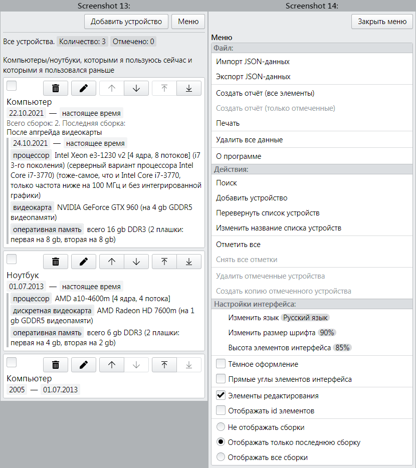
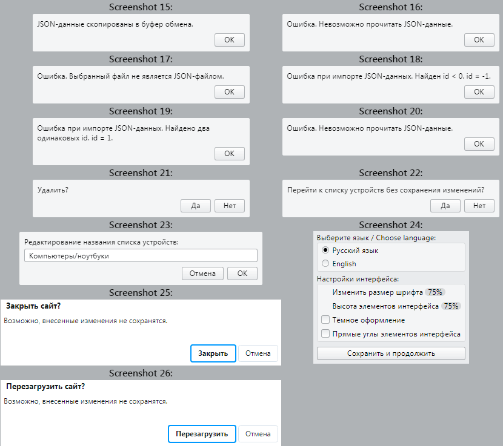

# Содержание

- [Даты изменения](#Даты-изменения)
- [Тип репозитория](#Тип-репозитория)
- [Информация о проекте](#Информация-о-проекте)
  - [Основная информация](#Основная-информация)
  - [Применённые технологии](#Применённые-технологии)
  - [Средства для автоматизации тестирования](#Средства-для-автоматизации-тестирования)
- [Скриншоты](#Скриншоты)
  - [Основные страницы](#Основные-страницы)
  - [Внешний вид на мобильных устройствах](#Внешний-вид-на-мобильных-устройствах)
  - [Модальные окна](#Модальные-окна)
  - [Тёмное оформление и остальные настройки внешнего вида](#Тёмное-оформление-и-остальные-настройки-внешнего-вида)

---

# Даты изменения

[⬆](#Содержание)

| Действие                           | Дата                |
|------------------------------------|--------------------:|
| Информация о проекте была изменена | 27.09.2022          |
| Скриншоты были сделаны             | 27.09.2022          |
| Работа над проектом началась       | примерно 07.01.2022 |

---

# Тип репозитория

[⬆](#Содержание)

Это не проект с открытым исходным кодом. Это портфолио в виде информации о проекте (со скриншотами результата работы над проектом).

---

# Информация о проекте

## Основная информация

[⬆](#Содержание)

Это web-приложение, которое я делаю для хранения структурированной текстовой информации о каких-либо сущностях (вещах, предметах, объектах).

Информация хранится в виде древовидной структуры с 3 уровнями вложенности. Каждая сущность принадлежит к какой-нибудь группе (1 уровень).

Для каждой сущности (2 уровень) можно задать:

- название;
- временной период;
- свойства (3 уровень) (для каждого свойства можно задать название и значение).

Все остальные действия представлены на скриншотах.

---

## Применённые технологии

[⬆](#Содержание)

- FrontEnd
  - HTML (своя вёрстка)
  - CSS (свои стили)
  - JavaScript
    - фреймворк "Vue JS"
- Средства для автоматизации тестирования
  - Библиотека "Selenium WebDriver" для Python.

Рендеринг HTML-страницы происходит на стороне клиента (FrontEnd) в JavaScript в фреймворке "Vue JS".

С самого начала работы над проектом (примерно c 07.01.2022) я использовал JavaScript-фреймворк "React JS", но потом 08.02.2022 я перевёл/переписал web-приложение на Vue JS. Сейчас в этом проекте используется только Vue JS.

---

## Средства для автоматизации тестирования

[⬆](#Содержание)

Автоматическое тестирование производится с помощью библиотеки "Selenium WebDriver" для Python. В ходе автотестирования выполняется: импорт данных, всевозможные действия над данными на всех уровнях вложенности (добавление, изменение, удаление, перемещение), экспорт данных.

---

# Скриншоты

## Основные страницы

[⬆](#Содержание)

---

## Внешний вид на мобильных устройствах

[⬆](#Содержание)

На мобильных устройствах всё выглядит также как на обычных устройствах, кроме меню. У меню 2 разных вида: для обычных устройств и для мобильных устройств. Вид меню зависит от ширины экрана.

---

## Модальные окна

[⬆](#Содержание)

Стандартные браузерные модальные окна используются только для подтверждения закрытия и перезагрузки страницы.

---

## Тёмное оформление и остальные настройки внешнего вида

[⬆](#Содержание)

В этом проекте к элементам интерфейса можно применить следующие настройки:
- Светлое\тёмное оформление.
- Скруглённые\острые углы элементов.
- Размер шрифта.
- Высота элементов (чем больше, тем удобнее для сенсорных экранов).

Результат применения настроек внешнего вида представлен в другом моём репозитории (этого же профиля), у которого описание "Элементы интерфейса, которые я использую для оформления web-страниц своих проектов".

---

[⬆](#Содержание)